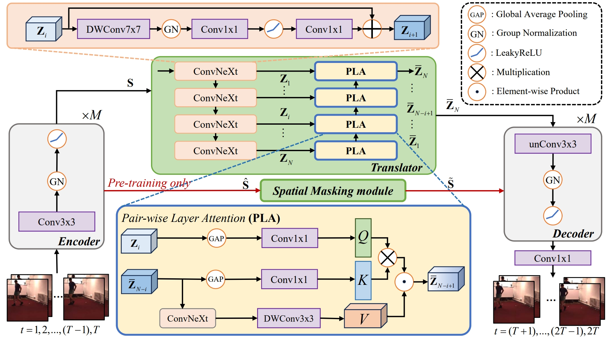
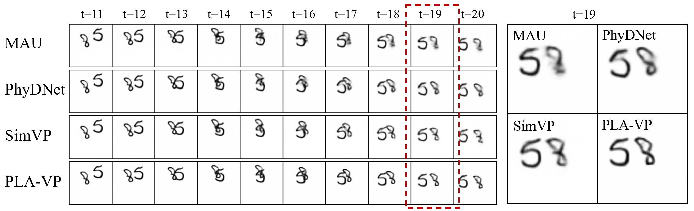

# PLA-SM

This repository contains the implementation code for paper:
**Pair-wise Layer Attention with Spatial Masking for Video Prediction**  

## Introduction

<p align="center">
     <br>
</p>

## Dependencies

* torch=1.9.0
* scikit-image=0.19.3
* numpy=1.21.5
* argparse
* tqdm=4.64.1
* addict=2.4.0
* fvcore=0.1.5
* hickle=5.0.2
* opencv-python=4.6.0
* pandas=1.3.5
* pillow=9.2.0
* [MinkowskiEngine]([ConvNeXt-V2/INSTALL.md at main · facebookresearch/ConvNeXt-V2 · GitHub](https://github.com/facebookresearch/ConvNeXt-V2/blob/main/INSTALL.md))

## Overview

* `simvp/api` contains an experiment runner.
* `simvp/core` contains core training plugins and metrics.
* `simvp/datasets` contains datasets and dataloaders.
* `simvp/methods/` contains training methods for various video prediction
* `simvp/models/` contains the main network architectures of various video prediction methods.
* `simvp/modules/` contains network modules and layers.
* `tools/non_dist_train.py` is the executable python file with possible arguments for training, validating, and testing pipelines.

## Prepare Dateset

```
  cd ./data/moving_mnist        
  bash download_mmnist.sh       #download the mmnist dataset
```

## Start Training

```
  python main_pretrain.py       #pretrain stage
  python main_train.py          #tarining stage
```

## Quantitative results on Moving MNIST

|                 | MSE  | MAE  | SSIM  |
|:---------------:|:----:|:----:|:-----:|
| PLA-VP          | 18.4 | 57.6 | 0.960 |

## Qualitative results on Moving MNIST

<p align="center">
     <br>
</p>

```
Citation

If you find this repo useful, please cite the following papers.
@article{
}
```

## Contact

If you have any questions, feel free to contact us through email (201050044@hdu.edu.cn)

## Acknowledgements

We would like to thank to the authors of [SimVP](https://ieeexplore.ieee.org/stamp/stamp.jsp?tp=&arnumber=9879439) for making their [source code](https://github.com/gaozhangyang/SimVP-Simpler-yet-Better-Video-Prediction) public which significantly accelerated the development of FFINet.
