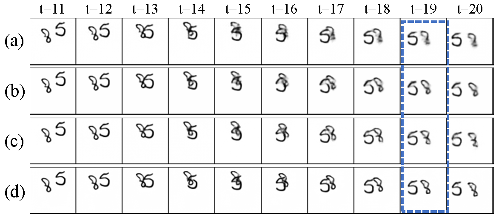

# PLA-SM

This repository contains the implementation code for paper:
**Pair-wise Layer Attention with Spatial Masking for Video Prediction**  

## Introduction
Video prediction yields future frames by employing the historical frames and has exhibited its great potential in many applications, e.g., meteorological prediction, and autonomous driving. Previous works often decode the ultimate high-level semantic features to future frames without texture details, which deteriorates the prediction quality. Motivated by this, we develop a Pair-wise Layer Attention (PLA) module to enhance the layer-wise semantic dependency of the feature maps derived from the U-shape structure in Translator, by coupling low-level visual cues and high-level features. Hence, the texture details of predicted frames are enriched. Moreover, most existing methods capture the spatiotemporal dynamics by Translator, but fail to sufficiently utilize the spatial features of Encoder. This inspires us to design a Spatial Masking (SM) module to mask partial encoding features during pretraining, which adds the visibility of remaining feature pixels by Decoder. To this end, we present a Pair-wise Layer Attention with Spatial Masking (PLA-SM) framework for video prediction to capture the spatiotemporal dynamics, which reflect the motion trend. 

<p align="center">
     <br>
</p>

## Dependencies

* torch=1.9.0
* scikit-image=0.19.3
* numpy=1.21.5
* argparse
* tqdm=4.64.1
* addict=2.4.0
* fvcore=0.1.5
* hickle=5.0.2
* opencv-python=4.6.0
* pandas=1.3.5
* pillow=9.2.0
* [MinkowskiEngine]([ConvNeXt-V2/INSTALL.md at main · facebookresearch/ConvNeXt-V2 · GitHub](https://github.com/facebookresearch/ConvNeXt-V2/blob/main/INSTALL.md))

## Overview

* `simvp/api` contains an experiment runner.
* `simvp/core` contains core training plugins and metrics.
* `simvp/datasets` contains datasets and dataloaders.
* `simvp/methods/` contains training methods for various video prediction
* `simvp/models/` contains the main network architectures of various video prediction methods.
* `simvp/modules/` contains network modules and layers.
* `tools/non_dist_train.py` is the executable python file with possible arguments for training, validating, and testing pipelines.

## Prepare Dateset

```
  cd ./data/moving_mnist        
  bash download_mmnist.sh       #download the mmnist dataset
```

## Start Training

```
  python main_pretrain.py       #pretrain stage
  python main_train.py          #tarining stage
```

## Quantitative results on Moving MNIST

|                 | MSE  | MAE  | SSIM  |
|:---------------:|:----:|:----:|:-----:|
| PLA-SM          | 18.4 | 57.6 | 0.960 |

## Qualitative results on Moving MNIST

<p align="center">
     <br>
</p>
(a) MAU; (b) PhyDNet; (c) SimVP; (d) Ours.
 
## Citation
If you find this repo useful, please cite the following papers.
```
@article{li-PLA-SM,
  author    = {Ping Li, Chenhan Zhang, Zheng Yang, Xianghua Xu, Mingli Song},
  title     = {Pair-wise Layer Attention with Spatial Masking for Video Prediction},
  journal   = {arXiv},
  year      = {2023},
  doi       = {https://doi.org/10.48550/arXiv.2311.XXXXX}
}
```

## Contact

If you have any questions, please feel free to contact Mr. Zhang Chenhan via email (201050044@hdu.edu.cn)

## Acknowledgements

We would like to thank to the authors of [SimVP](https://ieeexplore.ieee.org/stamp/stamp.jsp?tp=&arnumber=9879439) for making their [source code](https://github.com/gaozhangyang/SimVP-Simpler-yet-Better-Video-Prediction) public, which significantly accelerated the development of FFINet.
